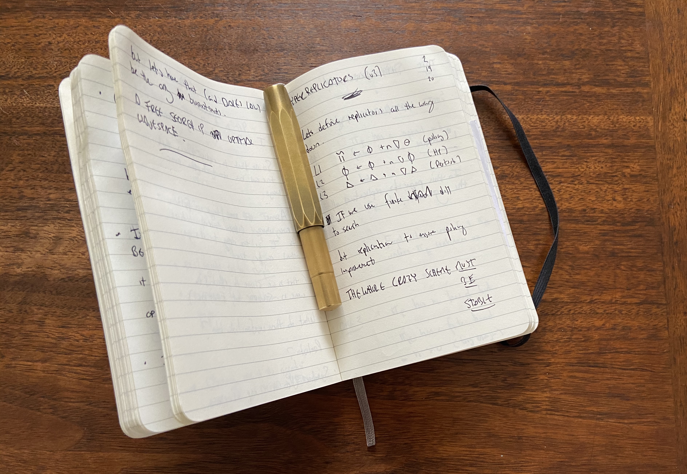

# Index 
Hi. I'm Erik. I'm research scientist at CMU. Here is an index of my scientific ideas. See `ideas.csv`.

# Index (long version)
A lot of my thinking happens by writing. I write in these small notebooks. They look like this:

Everytime I fill a notebook up, I copy it's table of contents to this index. I often add a little note, or two, for context. But not always. 

I decided, on a lark, to make this list public. 

If something interests you [email me](mailto:erik.exists@gmail.com). 
